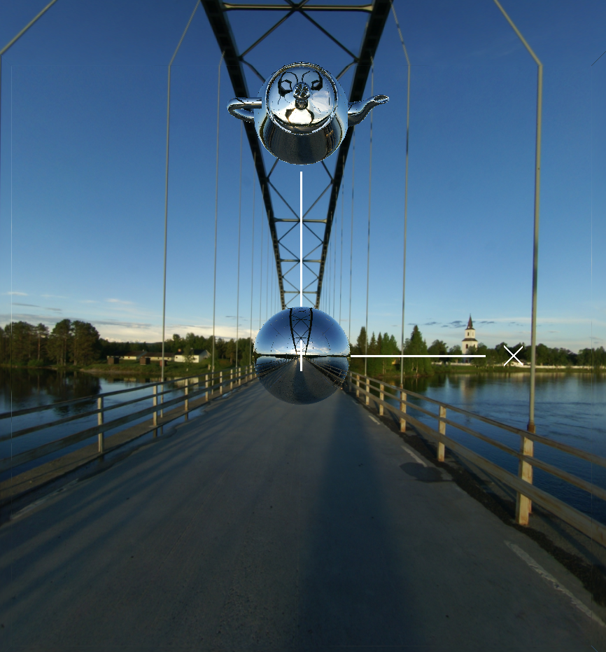

Hoimau Tan

**Project #4 Cube Mapping Reflective and Refractive Surfaces**

### **Description**

Apply Normal and eye vectors to build in the reflect and refract function to get the relectVector and refractVector. 

Then, by applying Vectors to the texture function, we can get the RGB value of the corresponding reflector or refractor wall.

Applying the RGB to gl_FragColor will give us the result, and by using the mix function, we can transform from reflection to refraction texture.

### **Result**

I loaded a bridge cube mapping scene from the provided website.

.png)
.png)
.png)

### **Link**

https://www.youtube.com/watch?v=ZJ9TmT_RlMk
